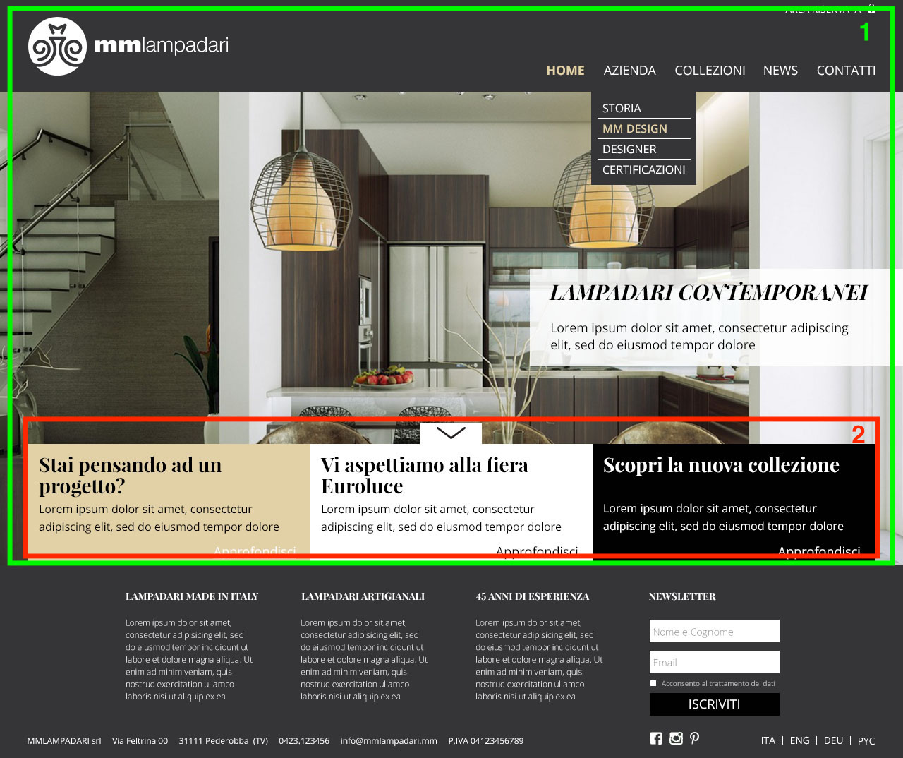

# Тестовое задание на стажировку в ADCI solutions

Сверстать страницу по макету. Макет находится в папке designs.

## Требования к верстке
1. Не использовать таблицы для создания лэйаута страницы
2. HTML5 семантичная верстка
3. Кроссбраузерность - последние версии популярных браузеров, IE11+
4. На странице используются следующие шрифты:
- Для заголовков:
[Playfair](http://www.google.com/fonts#UsePlace:use/Collection:Playfair+Display)
- Для остального: [Open Sans](http://www.google.com/fonts#UsePlace:use/Collection:Open+Sans)
5. Допускается использование jQuery.
6. **Не допускается использование CSS-фрейморков(bootstrap, foundation, etc.)**

## Спецификация
### Main Screen

Область отмеченная зеленым(1) должна быть растянута на весь экран, независимо от размеров экрана.

Блок отмеченный красным(2), по умолчанию скрыт, при нажатии на кнопку должен плавно выезжать снизу, при повторном нажатии плавно скрываться.

Картинка на главном экране это слайдер.

### Моальное окно
При нажатии на area riservata в правом верхнем углу хедера, открывается модально окно. Окно должно закрываться по нажатию на крестик или на облать за пределами модального окна.

### Responsive
Страница не должна ломаться на разных разрешениях экрана.

## Общие рекомендации
Если используете инструменты для ускорения разработки(препроцессоры, шаблонизаторы, таск-раннеры), для проверки лучше предоставить все исходники

Луше отправить законченную работу и не уложиться в срок, чем уложиться и прислать неготовую страницу. Однако в таком случае в сопроводительном письме следует указать причину задержки.

Работу лучше присылать ссылкой на GitHub(Gitlab/bitbucket)
